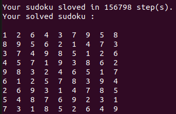

# Python Sudoku Solver
This project can solve sudoku puzzles. In solving tables, three conditions of being unique in row, column and 3 * 3 area are observed.

You must import your puzzle as a 2D python list in main.py file.Specify the empty cells in the puzzle with zero.For example a puzzle like this : 


This is how it is entered :

```python
my_table = [
    [0,2,0,0,0,0,0,0,0],
    [0,0,0,6,0,0,0,0,3],
    [0,7,4,0,8,0,0,0,0],
    [0,0,0,0,0,3,0,0,2],
    [0,8,0,0,4,0,0,1,0],
    [6,0,0,5,0,0,0,0,0],
    [0,0,0,0,1,0,7,8,0],
    [5,0,0,0,0,9,0,0,0],
    [0,0,0,0,0,0,0,4,0]
]

```
And finally run it : 
```bash
python3 main.py
```

## The result of solving sudoku
